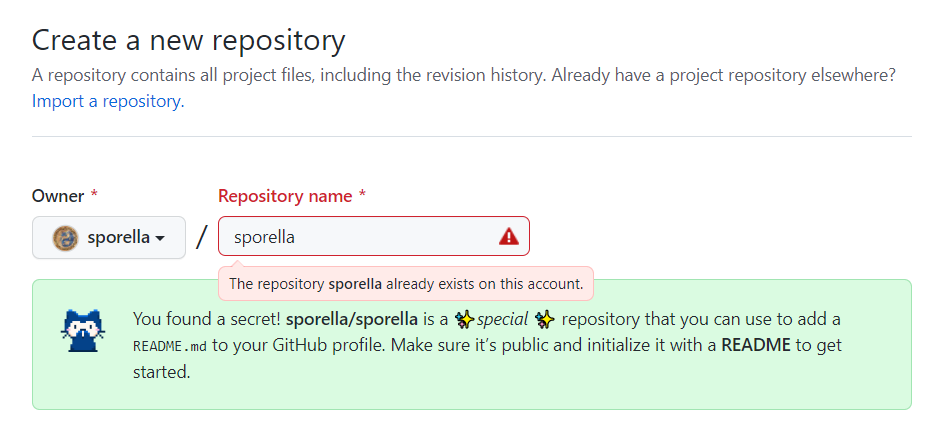
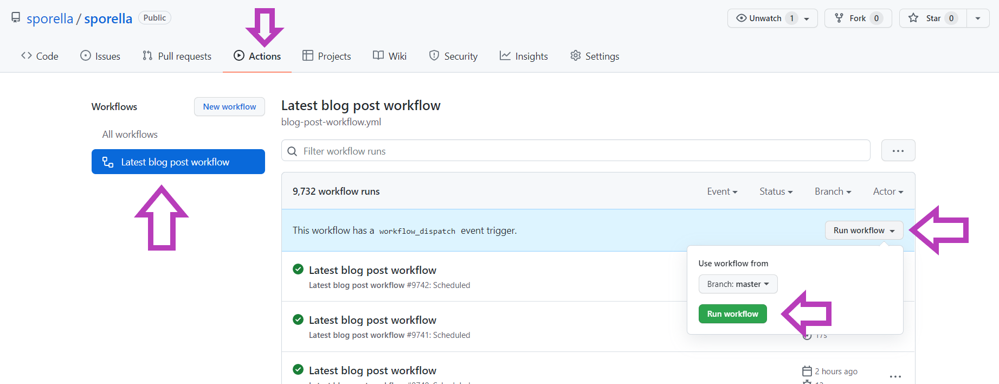

Cuando comencé a realizar proyectos de Ciencia de Datos desde el área de los Recursos Naturales, ni siquiera sabía que estaba haciendo Ciencia de Datos porque no tenía mucho contacto con ninguna comunidad de programación ni con personas que programaran fuera de mi laboratorio de investigación. Tampoco sabía la importancia de tener un portafolio de código que pudiese avalar mi experiencia programando, siempre decía: "¿Cómo compruebo que sé programar si tengo un título de Ingeniera Agrónoma?"

Tuvo que pasar el tiempo, hasta que en un taller de R-Ladies Santiago ([que también cito en este post](https://sporella.xyz/2019/09/24/hola-blogdown/)) aprendí la importancia de tener un sitio web o un perfil de GitHub en donde podamos compilar todas las actividades que hacemos: proyectos, talleres, experiencia, códigos sueltos, aportes a tidytuesday, etc. De esta forma, podemos redireccionar a un mismo sitio todo lo que comprueba nuesta experiencia cuando nos lo piden para postular a un trabajo, a una beca, a un programa de estudios, etc.

En este post hablaré de una funcionalidad muy útil que está disponible desde hace algún tiempo que permite generar un perfil en GitHub utilizando un repositorio con nuestro mismo nombre de usuaria. A pesar de que en un inicio decidí compilar toda mi información en este sitio web/blog, me di cuenta de que había personas que me contactaban porque habían llegado directamente a mi GitHub, así que decidí generar un perfil breve y conectar los últimos post de mi blog a través de la utilidad [Blog post workflow de Gautam krishna R](https://github.com/gautamkrishnar/blog-post-workflow) con GitHub actions.

Así que ¡Manos a la obra!

## Crear un perfil de GitHub

Primero debemos crear un nuevo repositorio con nuestro mismo nombre de usuaria. En mi caso, `sporella` (a mi me avisa que ya lo tengo creado):



En este repositorio, debemos crear un archivo README.md que será en donde escribiremos lo que queremos que aparezca en nuestro perfil. Yo escribí esto:

```{md, eval = F}
## Hola :octocat:

- :sunflower: Ingeniera Agrónoma y Magíster en Recursos Naturales
- :bar_chart: Trabajo como Científica de Datos. 
- 🗺️ Me gustan los datos espaciales, los mapas, la visualización de datos, la programación y enseñar. 
- :purple_heart: Soy parte de [RLadies Santiago](https://github.com/rladieschile)
- :blue_book: Soy [Instructora de Tidyverse](https://education.rstudio.com/trainers/people/orellana+stephanie/) certificada por RStudio.
```

Podemos agregar emojis [usando estos codigos](https://gist.github.com/rxaviers/7360908).

## Usar `Blog post workflow` de Gautam krishna

La idea de usar esta utilidad es poder conectar la lista de posteos de mi blog (también llamada `feed`) con el perfil de GitHub y que este se actualice periódicamente para encontrar los nuevos post. Veamos el paso a paso.

### Paso 1

Incluir `<!-- BLOG-POST-LIST:START --><!-- BLOG-POST-LIST:END -->` en el lugar en que queremos que aparezcan nuestros últimos post en nuestro perfil. Entonces, modificamos el archivo `README.md` para que quede así:

```{md, eval = F}
## Hola :octocat:

- :sunflower: Ingeniera Agrónoma y Magíster en Recursos Naturales
- :bar_chart: Trabajo como Científica de Datos. 
- 🗺️ Me gustan los datos espaciales, los mapas, la visualización de datos, la programación y enseñar. 
- :purple_heart: Soy parte de [RLadies Santiago](https://github.com/rladieschile)
- :blue_book: Soy [Instructora de Tidyverse](https://education.rstudio.com/trainers/people/orellana+stephanie/) certificada por RStudio.

## Últimos blog posts
<!-- BLOG-POST-LIST:START -->
<!-- BLOG-POST-LIST:END -->
```


### Paso 2

Incluir en el repositorio una carpeta que se llame `.github` y crear una carpeta dentro que se llame `workflows`. Dentro de ella, pondremos un código para realizar una acción que se repita cada cierto tiempo. Esto es lo que se llama `GitHub Actions`.

Puedes [mirar mi repositorio](https://github.com/sporella/sporella) para ver el sistema de archivos.

### Paso 3

Conseguir la lista de feed de tu blog, en mi caso se encuentra en la dirección web de la página de posteos + `/index.xml`, es decir:

`https://sporella.xyz/post/index.xml`

### Paso 4

Crear un archivo dentro de `.github/workflows/` llamado `blog-post-workflow.yml` y escribir lo siguiente:

```{md, eval = F}
name: Latest blog post workflow # Nombre del trabajo
on:
  schedule: # Corre el workflow automaticamente
    - cron: '0 * * * *' # Corre cada hora
  workflow_dispatch: # Correr el workflow manualmente (sin esperar a que sea llamado por cron), desde la pagina  de Github Actions directamente

jobs:
  update-readme-with-blog:
    name: Update this repo's README with latest blog posts
    runs-on: ubuntu-latest
    steps:
      - name: Checkout
        uses: actions/checkout@v2
      - name: Pull in dev.to posts
        uses: gautamkrishnar/blog-post-workflow@master
        with:
          feed_list: "https://sporella.xyz/post/index.xml"
```

En `feed_list` reemplazar por tu lista de feed

En `cron` se puede personalizar para que corra en tiempos determinados. [Ver aquí](https://geekflare.com/es/crontab-linux-with-real-time-examples-and-tools/) para saber más.

Puedes encontrar un lista de otros argumentos que puedes cambiar en el [repositorio de la utilidad](https://github.com/gautamkrishnar/blog-post-workflow#options).  

### Paso 5

Hacer `commit` y esperar a que corra. También lo puedes correr manualmente desde la pestaña "Actions".



### Resultado final

Una vez que la acción corrió correctamente podrás ver que se realizaron algunos cambios automáticos a tu archivo `README.md`. En mi caso ahora veo esto, que son los últimos post:

```{md, eval = F}
## Hola :octocat:

- :sunflower: Ingeniera Agrónoma y Magíster en Recursos Naturales
- :bar_chart: Trabajo como científica de datos. 
- 🗺️ Me gustan los datos espaciales, los mapas, la visualización de datos, la programación y enseñar. 
- :purple_heart: Soy parte de [RLadies Santiago](https://github.com/rladieschile)
- :blue_book: Soy [Instructora de Tidyverse](https://education.rstudio.com/trainers/people/orellana+stephanie/) certificada por RStudio.

## Últimos blog posts  :books:

<!-- BLOG-POST-LIST:START -->
- [30 días de mapas, mis apuntes](/2020/12/01/30daymap/)
- [Agregando utilidades al blog](/2020/10/12/agregando-utilidades-hugo/)
- [Visualización con highcharter: Brecha de género en carreras tecnológicas](/2020/05/13/highcharter-brechas/)
- [Música, datos y gráficos](/2020/05/12/musica-datos-y-graficos/)
- [¡Hola blogdown!](/2019/09/24/hola-blogdown/)
<!-- BLOG-POST-LIST:END -->
```

# Conclusión

Y de esta forma podemos crear un perfil sencillo para contar quienes somos y de paso aprender a usar GitHub actions para una tarea sencilla.

¿Has visto otros perfiles de GitHub? Hay algunos que son simplemente geniales, te dejo [esta lista](https://github.com/abhisheknaiidu/awesome-github-profile-readme) en donde podrás encontrar inspiración y mirar algunos códigos :eyes:. ¡Recuerda siempre dar atribución a los códigos que utilizas!